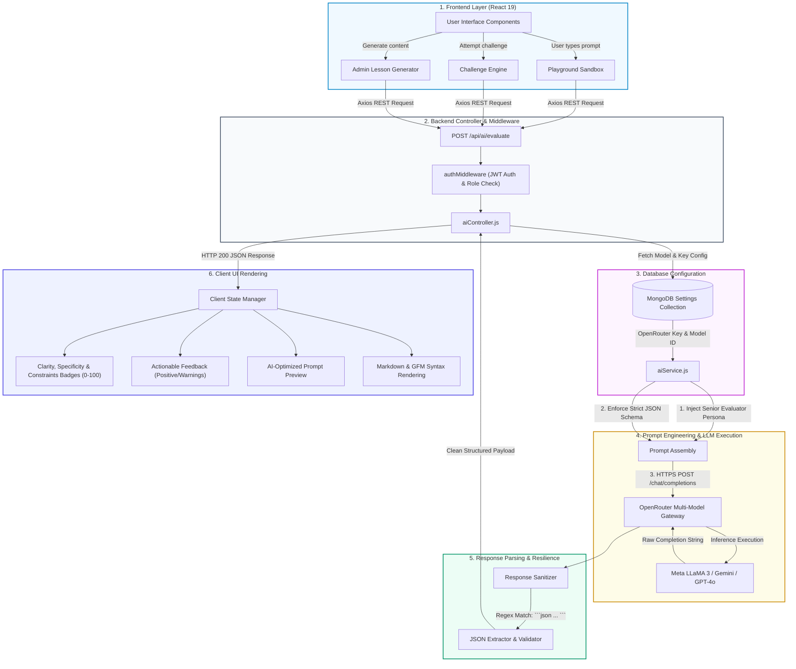

# Northern University of Business and Technology, Khulna
## Department of Computer Science and Engineering
### CSE4104: Web Technologies & Advanced AI Integration
---

# 📄 Week 8: AI Integration & Prompt Engineering Technical Report

**Project Title:** AI Prompt Engineering Learning Hub  
**Team ID:** CSE4104-7C-T02  
**Course Code:** CSE4104  
**Date of Submission:** August 08, 2026  
**GitHub Repository:** [https://github.com/RahminHossain/cse4104-7c-t02-ai-prompt-engineering-learning-hub](https://github.com/RahminHossain/cse4104-7c-t02-ai-prompt-engineering-learning-hub)  
**Live Deployment:** [https://cse4104-7c-t02-ai-prompt-engineerin.vercel.app](https://cse4104-7c-t02-ai-prompt-engineerin.vercel.app)  

---

## 1. Executive Summary & Team Information

### 1.1 Project Overview
The **AI Prompt Engineering Learning Hub** is an interactive, full-stack educational web platform designed to help developers and learners master prompt engineering through gamified lessons, interactive sandboxes, automated evaluations, and real-time AI-driven prompt optimization.

### 1.2 Team Information
- **Course:** CSE4104 – Web Technologies & Advanced AI Engineering
- **Team ID:** CSE4104-7C-T02
- **Institution:** Northern University of Business and Technology, Khulna (NUBTK)
- **Department:** Department of Computer Science and Engineering

---

## 2. Selected AI Platform & Integration Rationale

### 2.1 Platform Selection
We selected **OpenRouter API** as our centralized AI gateway platform. 

### 2.2 Why OpenRouter API?
1. **Multi-Model Flexibility:** OpenRouter provides a unified, OpenAI-compatible REST API interface that connects seamlessly to leading LLMs (Meta LLaMA 3, OpenAI GPT-4o, Google Gemini 1.5 Pro/Flash, and Mistral).
2. **Cost-Effective & High Performance:** Provides high-throughput free and low-cost tiers for educational benchmarking and student experimentation without vendor lock-in.
3. **Dynamic Model Switching:** Models can be dynamically updated by administrators via database settings without modifying or redeploying backend source code.

---

## 3. AI Models Used & Configuration Architecture

- **Primary Evaluator Model:** `meta-llama/llama-3-8b-instruct:free`
- **Fallback / Secondary Models:** `google/gemini-flash-1.5`, `openai/gpt-4o-mini`
- **Configuration Mechanism:** Admin panel provides real-time model selection and key updating, persisted securely in MongoDB (`settings` collection) and referenced during backend runtime execution.

---

## 4. Implemented AI Features

### 4.1 Interactive Prompt Evaluation Sandbox (Playground)
- Evaluates student-written prompts in real-time.
- Scores the prompt out of 100 on three core metrics: **Clarity**, **Specificity**, and **Constraints Compliance**.
- Generates structured, actionable tips (positive highlights, improvement areas, warnings).
- Automatically writes and delivers an **Optimized Prompt** recommendation.

### 4.2 Automated Prompt Engineering Challenges
- Users are presented with a specific **Target Output** and must craft a prompt that produces that exact target.
- The AI evaluates whether the prompt fulfills the goal, calculates a match score (0–100%), and grants XP/badges upon completion.

### 4.3 AI-Powered Administrative Lesson Generator
- A 1-click generative feature in the admin panel (`ManageLessonsModal`) that generates comprehensive, structured Markdown lessons with code blocks, real-world examples, and quiz scenarios.

---

## 5. End-to-End AI Workflow Architecture



---

## 6. Prompt Engineering Techniques & Production Prompts

### 6.1 Role & Persona Prompting
In `backend/src/services/aiService.js`, we establish a strict persona to eliminate hallucinations and enforce consistent scoring:

```text
You are a strict, senior prompt engineering evaluator. 
Evaluate the user's prompt. 
Provide a JSON response strictly with the following schema, and NOTHING else:
{
  "score": <overall score 0-100>,
  "clarity": <clarity score 0-100>,
  "specificity": <specificity score 0-100>,
  "constraints": <constraints score 0-100>,
  "feedback": [
    { "type": "positive" | "improvement" | "warning", "title": "<short title>", "desc": "<description>" }
  ],
  "optimized": "<An optimized, better version of the user's prompt>"
}
```

### 6.2 Target Output Verification Prompting (Challenges)
```text
You are a challenge evaluator. The user is trying to write a prompt that generates exactly the Target Output.
Target Output:
{{targetOutput}}

Given the user's prompt, determine if it successfully instructs an AI to generate the exact Target Output. 
Provide a JSON response strictly with the following schema:
{
  "success": <boolean>,
  "score": <number 0-100 (100 if exact match, lower if partially matching)>,
  "feedback": "<Explain why it succeeded or failed>"
}
```

---

## 7. AI Response Handling & Error Strategy

1. **Schema Constrained Parsing:** AI is strictly instructed to return valid JSON.
2. **Markdown Codeblock Regex Fallback:** If the LLM wraps its output in ` ```json ... ``` `, a regular expression extracts the raw JSON safely:
   ```javascript
   const jsonMatch = resultText.match(/```(?:json)?\s*(\{[\s\S]*?\})\s*```/);
   if (jsonMatch) return JSON.parse(jsonMatch[1]);
   ```
3. **Centralized Error Handling:** Missing API keys or invalid configurations fail gracefully with informative HTTP 400/500 toast notifications rather than crashing the UI.
4. **Markdown & Code Rendering:** Utilizes `react-markdown` and `remark-gfm` to render formatted lesson content and AI outputs with syntax highlighting.

---

## 8. Security & Credential Management

- **Zero Credential Exposure:** No API keys are hardcoded in client-side code or committed to GitHub.
- **Admin Configuration Security:** Keys and model settings are accessible only through authenticated, role-protected routes (`authorizeRoles('admin')`).
- **Encrypted Env Handling:** Secrets on production are managed securely through Vercel and Render environment variables.

---

## 9. Current Development Progress

- [x] **Full-Stack Core Architecture:** React 19 Frontend + Express.js Backend + MongoDB Database
- [x] **Authentication & Role System:** JWT-based login, register, and admin permissions
- [x] **AI Prompt Evaluation Sandbox:** Live testing, multi-criteria scoring, and prompt optimization
- [x] **Challenge Verification Engine:** Interactive prompt challenges with automated grading
- [x] **Gamified Mimo-Style Lesson Viewer:** Markdown rendering, progress tracking, and full-screen UI
- [x] **Admin Management Suite:** Modules, users, analytics, and AI integration settings
- [x] **Production Deployment:** Live on Vercel (Frontend) and Render (Backend)

---

## 10. Required Screenshots & Visual Evidence

> *Instructions: Insert your screenshots below corresponding to each required section before exporting to PDF.*

---

### Screenshot 1: AI Feature Interface (Playground)
*Caption: The Interactive AI Prompt Playground interface featuring the prompt input panel, evaluation button, and scoring dashboard.*

```
┌────────────────────────────────────────────────────────┐
│                                                        │
│            [ PASTE SCREENSHOT 1 HERE ]                 │
│         (Interactive AI Playground Interface)          │
│                                                        │
└────────────────────────────────────────────────────────┘
```

---

### Screenshot 2: AI Interaction
*Caption: User entering a test prompt into the Playground sandbox for real-time analysis.*

```
┌────────────────────────────────────────────────────────┐
│                                                        │
│            [ PASTE SCREENSHOT 2 HERE ]                 │
│        (User Typing Prompt & Submitting Query)         │
│                                                        │
└────────────────────────────────────────────────────────┘
```

---

### Screenshot 3: AI Responses & Evaluation Dashboard
*Caption: AI-generated response showing Overall Score, Clarity, Specificity, Constraints, and the Optimized Prompt suggestion.*

```
┌────────────────────────────────────────────────────────┐
│                                                        │
│            [ PASTE SCREENSHOT 3 HERE ]                 │
│         (Real-Time AI Response & Score Cards)          │
│                                                        │
└────────────────────────────────────────────────────────┘
```

---

### Screenshot 4: Prompt Examples & System Configuration
*Caption: Structured system prompt and schema definition used for AI evaluation in the backend service.*

```
┌────────────────────────────────────────────────────────┐
│                                                        │
│            [ PASTE SCREENSHOT 4 HERE ]                 │
│         (System Prompt Code in aiService.js)           │
│                                                        │
└────────────────────────────────────────────────────────┘
```

---

### Screenshot 5: Backend Integration
*Caption: Express route handler and OpenRouter API integration code.*

```
┌────────────────────────────────────────────────────────┐
│                                                        │
│            [ PASTE SCREENSHOT 5 HERE ]                 │
│      (Backend aiRoutes.js and Controller Logic)        │
│                                                        │
└────────────────────────────────────────────────────────┘
```

---

### Screenshot 6: GitHub Repository Activity
*Caption: GitHub repository overview showing organized directory structure and recent commit history.*

```
┌────────────────────────────────────────────────────────┐
│                                                        │
│            [ PASTE SCREENSHOT 6 HERE ]                 │
│        (GitHub Repository Commits & Structure)         │
│                                                        │
└────────────────────────────────────────────────────────┘
```

---

## 11. Conclusion

The **AI Prompt Engineering Learning Hub** successfully integrates state-of-the-art Large Language Models into a purposeful, educational workflow. By moving beyond simple text generation, the platform demonstrates meaningful AI application through structured evaluation, automated challenge validation, and intelligent prompt optimization.
